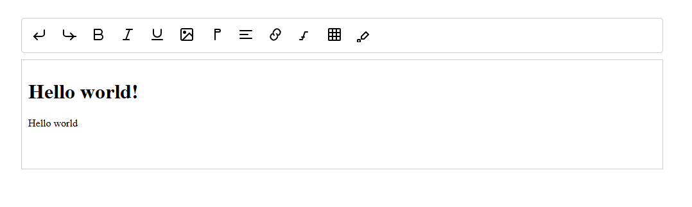

# Description

Seditor is a library for rich text editing with plugin architecture.

# Screenshots



# Usage

A simple usage with plugins

```html
<div style="width: 100%; margin: 0 auto; max-width: 1000px;">
  <div id="seditor-toolbar"></div>
  <div id="seditor-editor">Hello world!</div>
</div>

<script>
  const editor = new Editor("#seditor-toolbar", "#seditor-editor");
  // use plugins
  editor.use(undoRedoPlugin);
  editor.use(formattingPlugin);
  editor.use(fontPlugin);
  editor.use(colorPickerPlugin);
</script>
```

# Plugin development basics

```javascript
import type { EditorPlugin } from "../editor/types";
import { Editor } from "../editor/editor";

export const undoRedoPlugin: EditorPlugin = {
  name: "undoRedo",
  init(editor: Editor) {
    editor.addButton("undo", {
      text: "Undo",
      tooltip: "Undo",
      onAction: () => {
        editor.undo();
      },
    });
    editor.addButton("redo", {
      text: "Redo",
      tooltip: "Redo",
      onAction: () => {
        editor.redo();
      },
    });

    // keyboard shortcuts
    document.addEventListener("keydown", (e) => {
      if (e.ctrlKey && e.key === "z") {
        editor.undo();
      }
      if (e.ctrlKey && e.key === "y") {
        editor.redo();
      }
    });
  },
};

```
